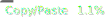

# knex

Knex.js implementation of js-items

## Installation:
`npm i @js-items/knex --save`

This package is heavily inspired by:
- [js-entity-repos/knex](https://github.com/js-entity-repos/knex)

Credits:
- [ryansmith94](https://github.com/ryansmith94)